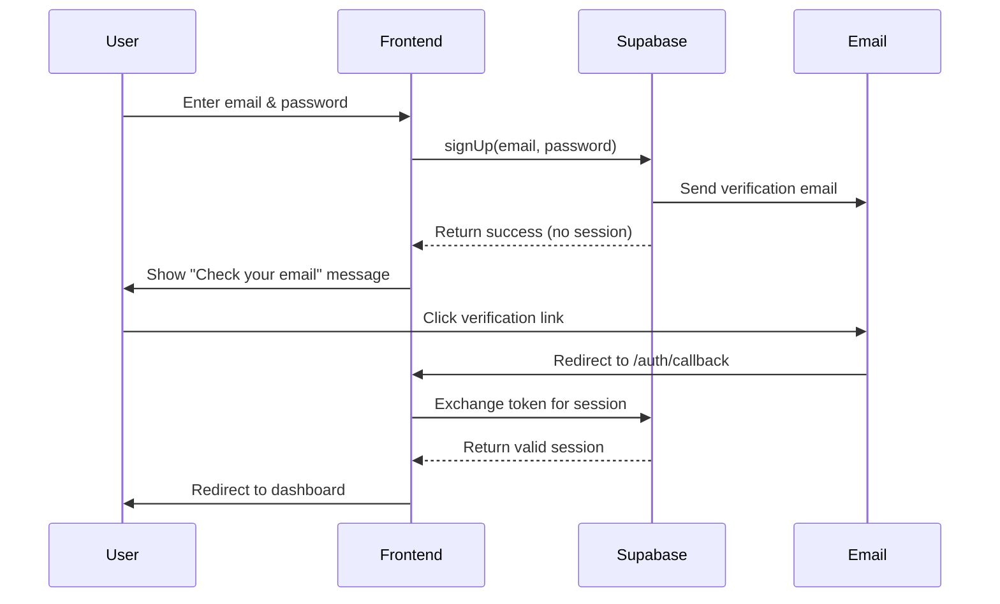
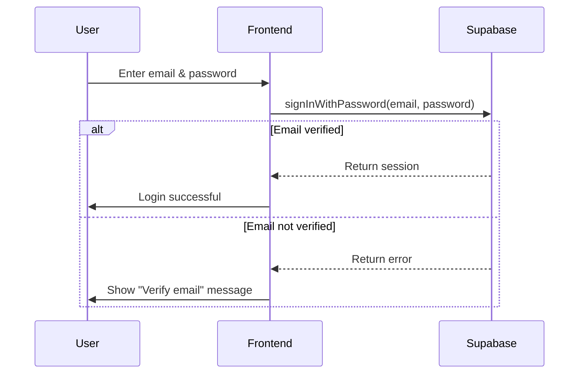
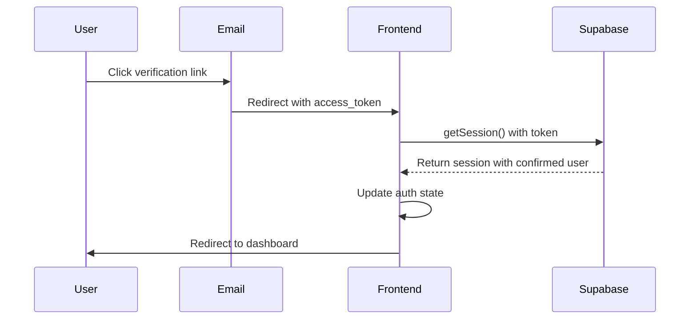

# Email Verification Setup Guide

## Overview

This guide provides complete instructions for configuring email verification in your Supabase project and explains how the authentication system works.

## Table of Contents

1. [Supabase Dashboard Configuration](#supabase-dashboard-configuration)
2. [Authentication Flow](#authentication-flow)
3. [Testing the Implementation](#testing-the-implementation)
4. [Troubleshooting](#troubleshooting)
5. [API Reference](#api-reference)

---

## Supabase Dashboard Configuration

### Step 1: Enable Email Confirmation

1. **Log in to Supabase Dashboard**
   - Go to [app.supabase.com](https://app.supabase.com)
   - Select your project

2. **Navigate to Authentication Settings**
   - Click on **Authentication** in the left sidebar
   - Click on **Providers**
   - Select **Email** provider

3. **Enable Email Confirmation**
   - Toggle **Enable email confirmations** to ON
   - This ensures users must verify their email before accessing the application

### Step 2: Configure Email Templates (Optional but Recommended)

1. **Navigate to Email Templates**
   - Click on **Authentication** → **Email Templates**

2. **Customize Confirmation Email**
   - Select **Confirm signup** template
   - Customize the email content to match your brand
   - Use these variables:
     - `{{ .ConfirmationURL }}` - The verification link
     - `{{ .Token }}` - The verification token
     - `{{ .Email }}` - User's email address

3. **Example Template:**

```html
<h2>Konfirmasi Email Anda</h2>
<p>Terima kasih telah mendaftar!</p>
<p>Klik tombol di bawah untuk mengaktifkan akun Anda:</p>
<a href="{{ .ConfirmationURL }}" style="background-color: #10b981; color: white; padding: 12px 24px; text-decoration: none; border-radius: 8px; display: inline-block;">
  Verifikasi Email
</a>
<p>Atau copy link berikut ke browser Anda:</p>
<p>{{ .ConfirmationURL }}</p>
<p>Link ini akan kedaluwarsa dalam 24 jam.</p>
```

### Step 3: Configure Redirect URLs

1. **Navigate to URL Configuration**
   - Go to **Authentication** → **URL Configuration**

2. **Add Redirect URLs**
   - **Site URL:** Your main application URL
     - Development: `http://localhost:5173`
     - Production: `https://yourdomain.com`

   - **Redirect URLs:** Add all valid callback URLs
     - Development: `http://localhost:5173/auth/callback`
     - Production: `https://yourdomain.com/auth/callback`

3. **Important Notes:**
   - URLs must match exactly (including protocol and port)
   - Wildcard URLs are supported: `http://localhost:*`
   - Add both development and production URLs

### Step 4: Configure Email Rate Limiting (Optional)

1. **Navigate to Auth Settings**
   - Go to **Authentication** → **Settings**

2. **Configure Rate Limits**
   - **Sign up rate limit:** Number of signups per hour (default: 100)
   - **Email rate limit:** Number of emails per hour (default: 10)
   - Adjust based on your expected traffic

### Step 5: SMTP Configuration (Optional for Production)

For production environments, configure custom SMTP to improve email deliverability:

1. **Navigate to SMTP Settings**
   - Go to **Project Settings** → **Auth**
   - Scroll to **SMTP Settings**

2. **Configure Your SMTP Provider**
   - **Host:** smtp.yourmailprovider.com
   - **Port:** 587 (TLS) or 465 (SSL)
   - **Username:** Your SMTP username
   - **Password:** Your SMTP password
   - **Sender email:** noreply@yourdomain.com
   - **Sender name:** Your App Name

3. **Recommended SMTP Providers**
   - SendGrid
   - AWS SES
   - Mailgun
   - Postmark
   - Resend

---

## Authentication Flow

### User Registration Flow



### User Login Flow



### Email Verification Callback Flow



---

## Implementation Details

### AuthContext Features

The updated `AuthContext` provides the following functionality:

1. **Email Confirmation Enforcement**
   - Checks `email_confirmed_at` field on all auth state changes
   - Prevents session creation for unverified users
   - Automatically signs out unverified users who attempt to login

2. **Sign Up Function**
   ```typescript
   signUp(email: string, password: string): Promise<{
     error: AuthError | null;
     needsEmailVerification: boolean;
   }>
   ```
   - Returns `needsEmailVerification: true` when email needs verification
   - Always clears session after signup
   - Prevents auto-login even if Supabase is misconfigured

3. **Sign In Function**
   ```typescript
   signIn(email: string, password: string): Promise<{
     error: AuthError | null;
   }>
   ```
   - Checks if email is confirmed before allowing login
   - Signs out immediately if email not verified
   - Returns custom error message for unverified users

4. **Resend Verification Email**
   ```typescript
   resendVerificationEmail(email: string): Promise<{
     error: AuthError | null;
   }>
   ```
   - Allows users to request a new verification email
   - Useful if email was not received or expired

### AuthForm Features

1. **Registration Flow**
   - Shows verification message after successful signup
   - Provides "Resend verification email" button
   - Clears form after successful registration

2. **Login Flow**
   - Detects unverified email attempts
   - Shows appropriate error message
   - Offers resend verification option

3. **User Experience**
   - Clear feedback at every step
   - Loading states during operations
   - Error messages in Indonesian

### AuthCallback Component

Handles email verification redirect:

1. **Token Exchange**
   - Extracts access token from URL hash
   - Exchanges token for valid session
   - Verifies email confirmation status

2. **Visual Feedback**
   - Loading state with spinner
   - Success state with checkmark
   - Error state with clear message

3. **Automatic Redirect**
   - Redirects to dashboard after successful verification
   - 2-second delay for user to see success message

---

## Testing the Implementation

### Test Scenario 1: New User Registration

1. **Register a new user**
   ```
   Email: test@example.com
   Password: Test123456
   ```

2. **Expected Behavior:**
   - ✅ Form shows success message
   - ✅ Verification email sent
   - ✅ User NOT logged in
   - ✅ Session is null

3. **Check Email:**
   - Open email inbox
   - Find verification email
   - Click verification link

4. **After Clicking Link:**
   - ✅ Redirected to `/auth/callback`
   - ✅ Success message displayed
   - ✅ Redirected to dashboard
   - ✅ User is logged in

### Test Scenario 2: Login Before Verification

1. **Try to login without verifying email**
   ```
   Email: test@example.com
   Password: Test123456
   ```

2. **Expected Behavior:**
   - ✅ Error message: "Email belum diverifikasi"
   - ✅ "Kirim ulang email verifikasi" button shown
   - ✅ User NOT logged in

### Test Scenario 3: Resend Verification Email

1. **Click "Kirim ulang email verifikasi"**

2. **Expected Behavior:**
   - ✅ New verification email sent
   - ✅ Success message shown
   - ✅ Email received in inbox

### Test Scenario 4: Verified User Login

1. **Login with verified account**

2. **Expected Behavior:**
   - ✅ Login successful
   - ✅ Redirected to dashboard
   - ✅ Session created
   - ✅ User data available

---

## Troubleshooting

### Issue: User Gets Auto-Logged In After Signup

**Symptoms:**
- User is logged in immediately after registration
- No verification email required

**Solution:**
1. Check Supabase dashboard: Authentication → Providers → Email
2. Ensure "Enable email confirmations" is toggled ON
3. Wait a few minutes for settings to propagate
4. Clear browser storage and try again

### Issue: Verification Email Not Received

**Possible Causes:**

1. **Email in Spam Folder**
   - Check spam/junk folder
   - Mark as "Not Spam" to improve future deliverability

2. **Incorrect Email Address**
   - Verify email address spelling
   - Try registering again with correct email

3. **SMTP Not Configured (Production)**
   - Configure custom SMTP in Supabase dashboard
   - Use reliable email service provider

4. **Rate Limiting**
   - Check if rate limit exceeded in Supabase logs
   - Wait and try again later

### Issue: Verification Link Expired

**Solution:**
1. Click "Kirim ulang email verifikasi" button
2. Check email and click new verification link
3. Links expire after 24 hours by default

### Issue: Callback Page Shows Error

**Possible Causes:**

1. **Invalid Token**
   - Token already used
   - Token expired
   - Solution: Request new verification email

2. **Redirect URL Not Configured**
   - Add callback URL to Supabase URL configuration
   - Must match exactly including protocol and port

3. **Browser Blocking Cookies**
   - Enable third-party cookies
   - Check browser privacy settings

### Issue: "Email Already Registered" Error

**Solutions:**

1. **If you registered but didn't verify:**
   - Use "Forgot password" flow to reset
   - Or contact support to delete unverified account

2. **If you previously registered:**
   - Use login instead of signup
   - Reset password if forgotten

---

## API Reference

### AuthContext Hook

```typescript
const {
  user,                      // Current user object or null
  session,                   // Current session or null
  loading,                   // Boolean: auth state loading
  signUp,                    // Function: register new user
  signIn,                    // Function: login user
  signOut,                   // Function: logout user
  resendVerificationEmail    // Function: resend verification
} = useAuth();
```

### Sign Up

```typescript
const { error, needsEmailVerification } = await signUp(
  'user@example.com',
  'SecurePassword123'
);

if (needsEmailVerification) {
  // Show "Check your email" message
}
```

### Sign In

```typescript
const { error } = await signIn(
  'user@example.com',
  'SecurePassword123'
);

if (error?.message.includes('Email not confirmed')) {
  // Show verification reminder
}
```

### Resend Verification

```typescript
const { error } = await resendVerificationEmail('user@example.com');

if (!error) {
  // Email sent successfully
}
```

---

## Security Considerations

### Best Practices

1. **Email Verification**
   - ✅ Always enabled in production
   - ✅ Prevents spam registrations
   - ✅ Verifies user ownership of email

2. **Password Requirements**
   - Minimum 6 characters (enforced by Supabase)
   - Recommend: 8+ characters with mixed case and numbers
   - Consider adding password strength meter

3. **Rate Limiting**
   - Configure appropriate limits in Supabase
   - Prevents brute force attacks
   - Protects against spam

4. **HTTPS Only**
   - Use HTTPS in production
   - Protects tokens in transit
   - Required for secure cookies

5. **Token Security**
   - Tokens expire after 24 hours
   - One-time use only
   - Securely transmitted via HTTPS

### Additional Security Features

Consider implementing:

1. **CAPTCHA** - Prevent bot registrations
2. **Two-Factor Authentication** - Extra security layer
3. **Password Reset Flow** - Allow users to recover accounts
4. **Account Deletion** - GDPR compliance
5. **Session Management** - View/revoke active sessions

---

## Production Checklist

Before deploying to production:

- [ ] Email confirmation enabled in Supabase
- [ ] Custom SMTP configured
- [ ] Redirect URLs configured for production domain
- [ ] Email templates customized
- [ ] Rate limits configured appropriately
- [ ] HTTPS enabled on production domain
- [ ] Email deliverability tested
- [ ] Error handling tested
- [ ] User experience reviewed
- [ ] Documentation updated

---

## Support

For issues or questions:

1. Check Supabase documentation: [supabase.com/docs/guides/auth](https://supabase.com/docs/guides/auth)
2. Review Supabase logs: Dashboard → Logs → Auth Logs
3. Check browser console for errors
4. Review network requests in browser DevTools

---

## Changelog

### Version 2.0.0 (Current)

- ✅ Enhanced email verification enforcement
- ✅ Added `needsEmailVerification` flag
- ✅ Improved error messages
- ✅ Added resend verification feature
- ✅ Created dedicated callback page
- ✅ Enhanced state management
- ✅ Added comprehensive logging
- ✅ Improved user experience

---

**Last Updated:** November 2024
**Version:** 2.0.0
**Status:** Production Ready
